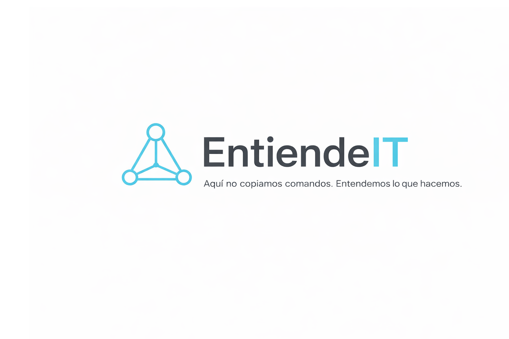

<p align="center">
  
</p>

# 🛡️ Solución: El mensaje de "Authentication Required" (GNOME Keyring)


Si te aparece un cuadro de diálogo flotante en bucle pidiendo la contraseña del depósito de claves cada vez que abres tu navegador web en entornos Linux, aquí tienes la solución definitiva explicada paso a paso.

---

## 🚨 El Problema y la Causa

El popup aparece porque la contraseña de tu usuario de sistema ha cambiado (por ejemplo, mediante comandos `passwd` o permisos `sudo`), pero el depósito de claves de GNOME (**GNOME Keyring**) sigue esperando la contraseña antigua. También ocurre frecuentemente si tienes activado el inicio de sesión automático, ya que el sistema no introduce tus credenciales al arrancar para desbloquear el depósito.

---

## 🛠️ Solución Paso a Paso

### 🔍 Paso 0: Verificación del inicio automático (GDM3)
Antes de nada, comprueba si tienes el inicio automático habilitado inspeccionando la configuración del gestor de pantallas:

```bash
cat /etc/gdm3/daemon.conf

Si ves la línea AutomaticLoginEnable = true sin comentar, esta es la razón por la que no se desbloquea solo al arrancar.

🚀 Paso 1: Lanzar Seahorse
Abre una terminal (Ctrl + Alt + T) y ejecuta el gestor gráfico oficial de contraseñas de GNOME:
seahorse

🔴 Paso 2: Eliminar el Depósito Desincronizado
En la ventana de "Contraseñas y claves", busca en el panel izquierdo la sección Passwords (Contraseñas).
Haz clic derecho sobre "Default keyring" (o en algunos casos llamado "Login").
Selecciona la opción Delete (Eliminar) y confirma.

[!WARNING]
ADVERTENCIA CRÍTICA: Al borrar este depósito, perderás las contraseñas que tuvieras guardadas de forma estrictamente local en tu navegador Chrome.
Asegúrate de tener la sincronización en la nube de tu cuenta de Google activa antes de realizar este paso.

🔄 Paso 3: SincronizaciónCierra Google Chrome por completo.
Vuelve a abrir el navegador. El sistema operativo detectará que no hay depósito predeterminado y te pedirá configurar una nueva contraseña para él.
Escribe exactamente la misma contraseña que utilizas para iniciar sesión en tu ordenador.¡Listo!
A partir de este momento, el mensaje molesto no volverá a aparecer.

📄 Guía Visual en PDF
En la carpeta docs/ de este directorio tienes disponible el archivo interactivo en formato PDF listo para descargar o visualizar.

👉 [Descargar PDF de la Guía](./docs/Arreglar_keyring.pdf)

